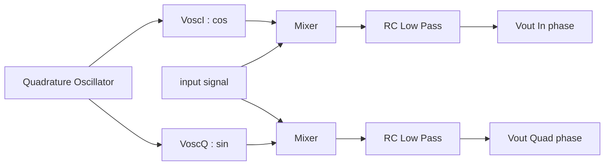

# Quadrature Down Convertor

This project contains the design and analysis of a Quadrature Down Convertor which is used at the receiving end of Analog Communications. The QDC circuit contains three major subcircuits namely :- 
* Quadrature Oscillator
* Mixer Circuit
* RC Low Pass Filter

The simulation of the QDC is done in LT-Spice Software and the repository contains 4 main Spice files :- one each for each of the subparts of the QDC and a final Spice containing the working QDC. A report containing the thorough explanation, observations and results is also contained alongwith the presentation pdf used.

## Running the Simulations

For running the simulations, **LT-Spice** Software is required which can be downloaded from [here](https://ltspice-iv.en.lo4d.com/windows). Opening the `.asv` files in LT-Spice will open the circuit and the simulations can be run easily.

## Flow Diagram
The following Figure represents the general flow of the QDC System highlighting the three parts of the convertor.

### Team
The team for making of this project is :-
* Tejas Srivastava
* Mayank Shivhare
* Ajay Ray
